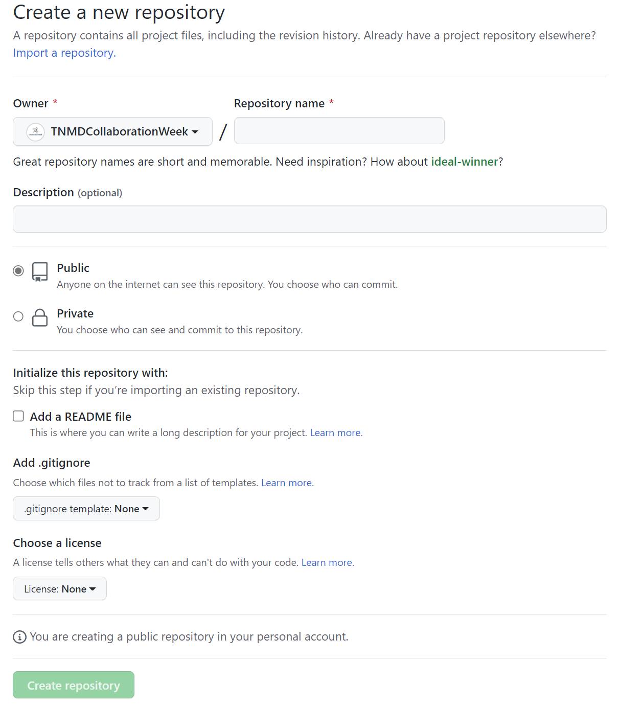
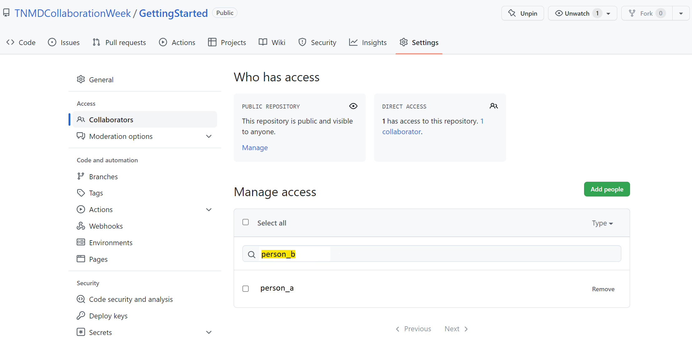
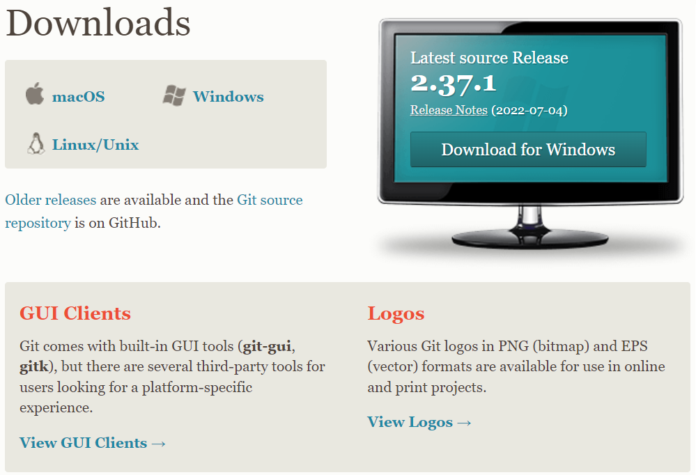
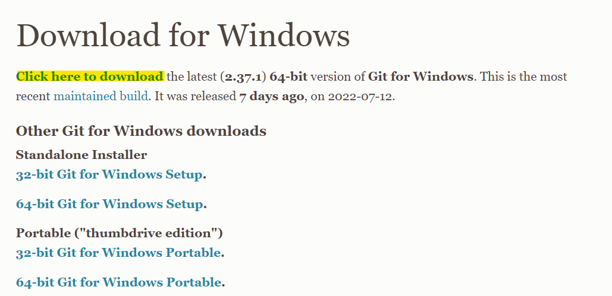
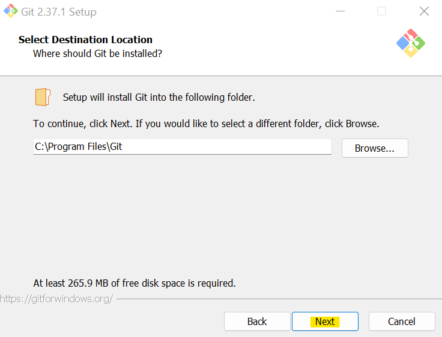
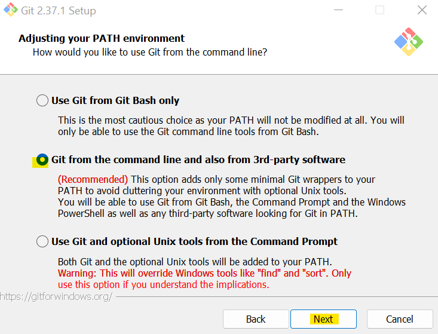
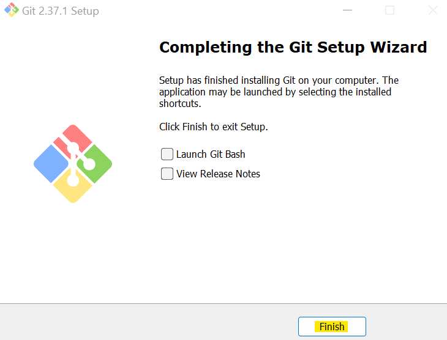

# Getting Started    

Welcome to the Collaboration Week mini-hackathon. This `README` document contains instructions for how to get started.   

## Step 1: Create a personal GitHub account (everyone)  
To access the team GitHub repository, you will need to create a new GitHub account or use an existing public GitHub account. The account name can be `firstnamelastname` as long as you do not reference any internal work or work organisation information on your GitHub account. You are also welcome to use code names like `lazywombat` for your Github account.    

Account creation steps
  

   

1. Navigate to [https://github.com/](https://github.com/) and enter your **non-work** email address to sign up for a GitHub account.   

        

2. This takes you to the next prompt where you are asked to create a password and GitHub username. You can type `n` to avoid receiving GitHub announcements through email.   

         

3. Verify your account through your nominated non-work email address.   

4. Sign up to a **free** GitHub account i.e. student account for use with 5 - 10 members. You can leave all other GitHub features unticked.   

5. Congratulations! You have now logged into your personal GitHub account. Send your username to your team lead. Your account will look relatively empty at first, like the example below.  

       

  

  

## Step 2: Create a public repository and add team members (team leads)  
Team leads also need to create a public repository in their GitHub account and then add all team members as repository collaborators.  

Repository creation and collaborator addition steps
  

  

1. Log into your GitHub account and navigate to [https://github.com/new](https://github.com/new) to create a new repository (you can also click `+` -> `New repository` to access this from the top right hand corner inside GitHub). A repository can be thought of as a contained space to store all the code, documentation and analytical outputs produced by your project.  

2. Choose a name for your new team repository. Select the **public** repository and tick to add a README file. You can ignore the `Add .gitignore` and `Choose a license` options. Click `Create repository`.    

       

3. Navigate to your new repository via the main page (you can also access your main page at `www.github.com/yourusername`). Click on your new repository and navigate to the `Settings` tab in the bar under your repository name. Click the `Collaborators` tab and then click on the green box `Add people`. Search for your team members and then click `Add user to this repository`. Repeat this step for all your team members.   

       

4. An email notification should be sent to your team member. Ask your team member to open the invite and accept the collaborator request. Your team member should now be able to commit and push code to your team repository.   

       

## Step 3: Install Git for use with GitHub (everyone)
GitHub is just a website which hosts your project contents. Git is actually the software which you use to track code changes and Git can actually be used with any project repository i.e. BitBucket, AWS CodeCommit.   

Installing `Git` allows you to perform commands to clone code, modify it and then publish a new version in your code repository. We can use Git through the command line interface (CLI) or through the graphical user interface (GUI). For simplicity, we will demonstrate Git using the GUI but people are also welcome to use the CLI.   

Git installation steps
  

  

1. Git is installed by default on Mac and Linux machines. Search through your applications to check whether you already have Git installed. To install Git on your non-work laptop or computer, navigate to [https://git-scm.com/downloads](https://git-scm.com/downloads) and select your operating system.    

       

2. For Windows users, click on `Click here to download` and then open the downloaded file (which will be called something like `Git-2.37.1-64-bit`). Proceed by allowing the program to make changes to your computer.    

        

3. An installation prompt should appear. Click through `Next` and leave the default component selection unchanged (i.e. install both Git Bash and Git GUI). If you have a code editor i.e. Visual Studio Code, select that as your default editor. If not, you can still select Notepad as a basic code/text editor. Keep the default settings and click through `Next` until the installation takes place.   

       
        

4. Click `Finish` to exit the Git Setup prompt.  

       

5. Congratulations! You have now installed Git in your non-work environment. You should now be able to access the Git GUI via the search bar.  

       

## Step 4: Using Git to publish code to GitHub (everyone)   

# Other resources   
+ The [Git tutorials](https://www.atlassian.com/git/tutorials/setting-up-a-repository) and [Git cheatsheet](https://www.atlassian.com/git/tutorials/atlassian-git-cheatsheet) from Atlassian.   
+ The [R Programming Git Guide Book](https://happygitwithr.com/) written by Jenny Bryan and [contributors](https://happygitwithr.com/contrib.html).   
+ [Instructions for using the Git GUI](https://www.geeksforgeeks.org/working-on-git-for-gui/) from GeeksforGeeks.    
+ [Instructions for using Git Bash with GitHub](https://www.geeksforgeeks.org/ultimate-guide-git-github/?ref=lbp) from GeeksforGeeks.   