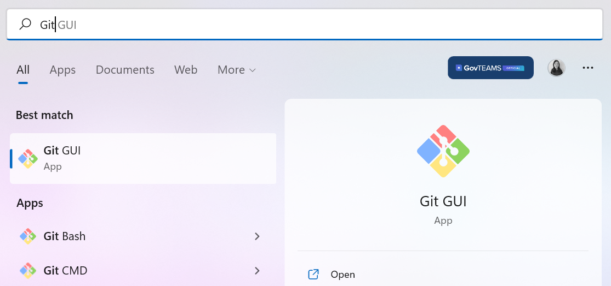

# Getting Started    
Welcome to the Collaboration Week mini-hackathon. This `README` document contains instructions for how to get started. Remember to work **outside** your work environment with your personal GitHub account at all times during this challenge. 

# Recommended YouTube videos  
We recommend watching [Learn Git in 15 minutes](https://www.youtube.com/watch?v=USjZcfj8yxE) or the more in-depth [Git & GitHub Crash course](https://www.youtube.com/watch?v=RGOj5yH7evk) before starting the mini-hackathon.   

## Step 1: Create a personal GitHub account (everyone)  
To access the team GitHub repository, you will need to create a new GitHub account or use an existing public GitHub account. The account name can be `firstnamelastname` as long as you do not reference any internal work or work organisation information on your GitHub account. You are also welcome to use code names like `lazywombat` for your Github account.     

:rotating_light:Account creation steps
  

   

1. Navigate to [https://github.com/](https://github.com/) and enter your **non-work** email address to sign up for a GitHub account.   

        

2. This takes you to the next prompt where you are asked to create a password and GitHub username. You can type `n` to avoid receiving GitHub announcements through email.   

         

3. Verify your account through your nominated non-work email address.   

4. Sign up to a **free** GitHub account i.e. student account for use with 5 - 10 members. You can leave all other GitHub features unticked.   

5. Congratulations! You have now logged into your personal GitHub account. Send your username to your team lead. Your account will look relatively empty at first, like the example below.  

       

  

  

## Step 2: Create a public repository and add team members (team leads)  
Team leads also need to create a public repository in their GitHub account and then add all team members as repository collaborators.  

:rotating_light:Repository creation and collaborator addition steps
  

  

1. Log into your GitHub account and navigate to [https://github.com/new](https://github.com/new) to create a new repository (you can also click `+` -> `New repository` to access this from the top right hand corner inside GitHub). A repository can be thought of as a contained space to store all the code, documentation and analytical outputs produced by your project.  

2. Choose a name for your new team repository. Select the **public** repository and tick to add a README file. You can ignore the `Add .gitignore` and `Choose a license` options. Click `Create repository`.    

       

3. Navigate to your new repository via the main page (you can also access your main page at `www.github.com/yourusername`). Click on your new repository and navigate to the `Settings` tab in the bar under your repository name. Click the `Collaborators` tab and then click on the green box `Add people`. Search for your team members and then click `Add user to this repository`. Repeat this step for all your team members.   

       

4. An email notification should be sent to your team member. Ask your team member to open the invite and accept the collaborator request. Your team member should now be able to commit and push code to your team repository.   

       

## Step 3: Install Git for use with GitHub (everyone)
GitHub is just a website which hosts your projects inside individual repositories. Git is actually the software which you use to track code changes and Git can actually be used with any project repository i.e. BitBucket, AWS CodeCommit.   

Installing `Git` allows you to perform commands to clone code, modify it and then publish a new version in your code repository. We can use Git through the command line interface (CLI) or through the graphical user interface (GUI). For simplicity, we will demonstrate Git using the GUI but people are also welcome to use the CLI.     

:rotating_light:Git installation steps
  

  

1. Git is installed by default on Mac and Linux machines. Search through your applications to check whether you already have Git installed. To install Git on your non-work laptop or computer, navigate to [https://git-scm.com/downloads](https://git-scm.com/downloads) and select your operating system.    

       

2. For Windows users, click on `Click here to download` and then open the downloaded file (which will be called something like `Git-2.37.1-64-bit`). Proceed by allowing the program to make changes to your computer.    

        

3. An installation prompt should appear. Click through `Next` and leave the default component selection unchanged (i.e. install both Git Bash and Git GUI). If you have a code editor i.e. Visual Studio Code, select that as your default editor. If not, you can still select Notepad as a basic code/text editor. Keep the default settings and click through `Next` until the installation takes place.   

       
        

4. Click `Finish` to exit the Git Setup prompt.  

       

5. Congratulations! You have now installed Git in your non-work environment. You should now be able to access the Git GUI via the search bar.  

       

## Step 4: Using Git to publish code to GitHub (everyone)  
The best way to imagine how to use a code repository like GitHub is to think about how a team ideally works. First, you would need a central project repository that is stable and that everyone can access. This is known as the **remote repository**. Individuals work in a local environment (which may contain older or newer code compared to the remote repository) and this is known as the **local repository**.   

The remote repository hosts the stable and most up-to-date version of the team project i.e. all the code, documentation and non-sensitive outputs. At any one time, multiple individuals might be working on different components of a project. This means that individuals might have slightly different versions of code or documentation sitting in their local repositories.  

The goal is to communicate clearly on what you are working on, and save (i.e. commit) and publish (i.e. push) your local modifications back to your remote project repository as soon as you have finished a task.  

   

:rotating_light:Code version control steps
  

  

### Clone your remote repository  
1. Navigate to the GitHub repository that your team lead has created. Click on the green `Code` button and copy the HTTPS link for your repository. We would like to create a clone of this remote repository in our local environment via the copied HTTPS link.  

        

2. Open the Git GUI and click `Clone existing repository`. This takes you to a window where you can enter your copied HTTPS link as the source location, and a new local working directory as your target location `C:/Users/username/Desktop/git_project/repository_name`. Click `Clone`.    

        
       

3. Congratulations! You now have a local version of your project repository. Your local repository will store the link to your remote GitHub repository automatically.  

### Create a separate local repository branch  
It is always a good habit to work on a branch which is separate to your main branch. This prevents you from accidentally overwriting your team's remote project repository without someone else to peer review your changes. 

     

1. In your newly cloned local repository, navigate to `Branch` -> `Create...` to create a new branch. Name your branch something like `username_dev`.   

         

2. Click `Create` and you will automatically switch to working inside your new `username_dev` branch.   

### Add new code to your remote repository  
1. Navigate to your local working directory i.e. `C:/Users/user/git_repo/project` and start working on your project. Save all changes to your code or documents.  
2. To register your changes locally, first click `Rescan` to scan for local file updates. The bash equivalent of this is to type `git status`. Any new changes made in your local working directory will now appear under the `Unstaged Changes` window.   

       

3. Add your new changes by clicking `Stage Changed`. The bash equivalent of this is to type `git add`. Added changes will now appear under the `Staged Changes` window.   

       

4. Register a new code version change by writing a new commit message in the Git GUI textbox and then clicking `Commit`. The bash equivalent of this is to type `git commit`. This registers a safe version of your code changes locally, which then enables you to push your committed changes to your remote repository.   

       

5. To push your local changes back to the remote repository, click `Push`. **Remember to push from your `username_dev` branch to your remote repository**. The Git GUI will push to a newly created remote GitHub branch named `username_dev`. This allows you to create a remote copy of your own changes, which a team member can review before integration back into your team's remote repository `main` branch. The bash equivalent of this is to type `git push origin HEAD:username_dev`.    

       

### Code peer review  
Congratulations! Your local code changes have now been committed to your remote repository. But the work isn't over. Working in a team, we would ideally want to implement a final level of code peer review before changes are integrated into the main remote repository (i.e. stable project version).    

1. To review your newly pushed changes, navigate to your GitHub repository and look for your `username_dev`, which contains the new version of code changes that you introduced. The peer reviewer can now choose to integrate these changes by navigating to `Contribute` -> `Open pull request`.  

       

2. This takes you to a new page, where a comparison of the `username_dev` and `main` branches is performed to check that the `username_dev` code changes can be successfully merged into the remote repository `main` branch. Optional: write a message documenting that peer review has been conducted and click `Create pull request`.    

       

3. Click `Merge pull request` to complete your code merge with the remote repository `main` branch. You will be asked to confirm this decision again. Remember to delete the `username_dev` branch after your changes have been successfully merged, as you no longer need this branch i.e. this reduces branch clutter for the team. 

       

:tada:Congratulations! You have successfully added changes to your team's remote repository!    

### Update your local repository with your team member's new changes   
1. Imagine that your team member has made a new change to the remote repository `main` branch whilst you were working locally on your own changes. This happens all the time. To integrate your team member's new remote changes, click `Remote` -> `Fetch from` -> `origin` to fetch the latest copy of the team's remote repository and then click `Merge` -> `Local Merge...` to merge these changes to your local repository. The bash equivalent of these two steps is to type `git push`.  

        

**Warning:** If your team member and you are working on the same code changes, you will receive a code conflict error message. You can handle code conflicts by choosing the version of code to accept and then merging the rest of the project together. Ask your team lead or a hackathon helper if you get stuck here.  

  

  

# Other resources   
+ The [Git tutorials](https://www.atlassian.com/git/tutorials/setting-up-a-repository) and [Git cheatsheet](https://www.atlassian.com/git/tutorials/atlassian-git-cheatsheet) from Atlassian.   
+ The [R Programming Git Guide Book](https://happygitwithr.com/) written by Jenny Bryan and [contributors](https://happygitwithr.com/contrib.html).   
+ [Instructions for using the Git GUI](https://www.geeksforgeeks.org/working-on-git-for-gui/) from GeeksforGeeks.    
+ [Instructions for using Git Bash with GitHub](https://www.geeksforgeeks.org/ultimate-guide-git-github/?ref=lbp) from GeeksforGeeks.   
+ A comprehensive list of [Git debugging instructions](https://dangitgit.com/en) from DangItGit.  