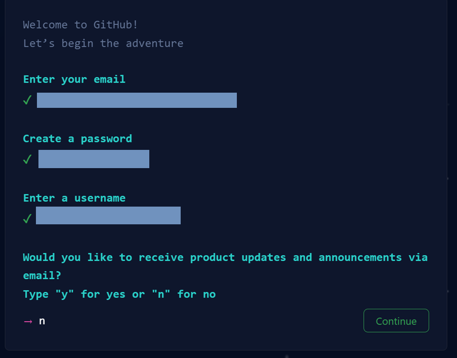

# Getting Started    

Welcome to the Collaboration Week mini-hackathon. This `README` document contains instructions for how to get started.   

## Step 1: Create a personal GitHub account (everyone)  
To access the team GitHub repository, you will need to create a new GitHub account or use an existing public GitHub account. The account name can be `firstnamelastname` as long as you do not reference any internal work or work organisation information on your GitHub account. You are also welcome to use code names like `lazywombat` for your Github account.    

Account creation steps
  

   

1. Navigate to [https://github.com/](https://github.com/) and enter your **non-work** email address to sign up for a GitHub account.   

       

2. This takes you to the next prompt where you are asked to create a password and GitHub username. You can type `n` to avoid receiving GitHub announcements through email.   

        

3. Verify your account through your nominated non-work email address.   

4. Sign up to a **free** GitHub account i.e. student account for use with 5 - 10 members. You can leave all other GitHub features unticked.   

5. Congratulations! You have now logged into your personal GitHub account. Send your username to your team lead. Your account will look relatively empty at first, like the example below.  

      

  

  

## Step 2: Create a public repository and add team members to repository (team leads)  
Team leads also need to create a public repository in their GitHub account and then add all team members as repository collaborators.  

Repository creation steps
  

  

1. Log into your GitHub account and navigate to [https://github.com/new](https://github.com/new) to create a new repository (you can also click `+` -> `New repository` to access this from the top right hand corner inside GitHub). A repository can be thought of as a contained space to store all the code, documentation and analytical outputs produced by your project.  

2. 

Step 3: Learn how to use Git with GitHub   
Step 4: Mini-hackathon ideas   
